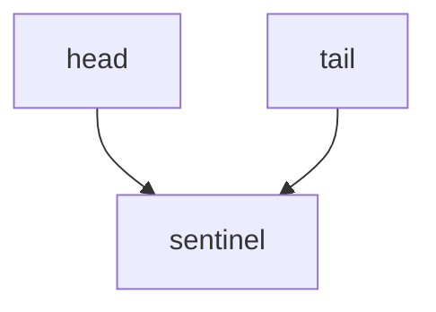
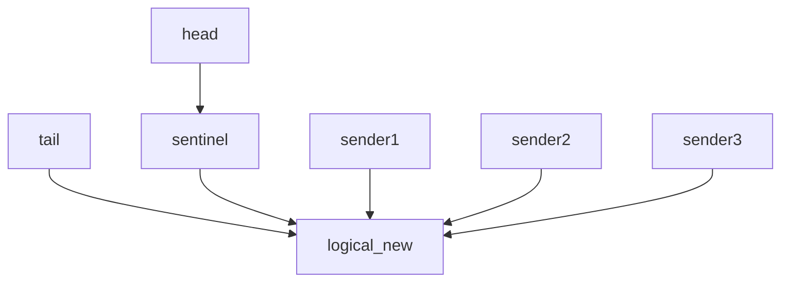
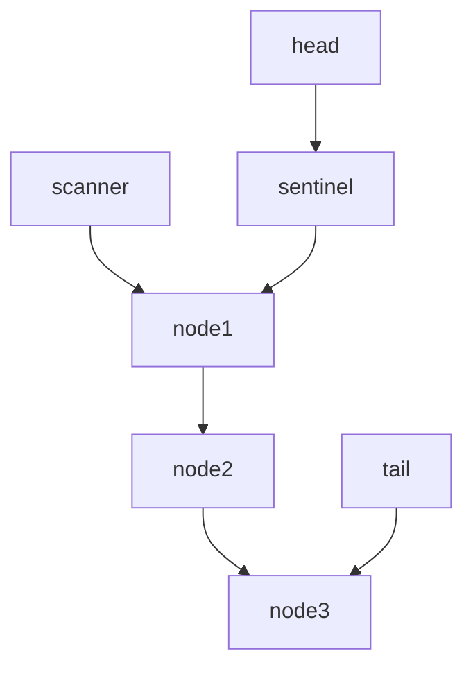

# 基于Key排序的mpsc.

Key-based mpsc provides a mpsc unbouned channel, with keys collision detection.

**NOTE: key-based mpsc is on the early stage, security issue has a lot and the performence is bad, don't use it in production environment.**

It uses a simple Linked List struture to implement a lock-free multiple producer, single consumer channel. 

## 频道是如何工作的？
频道刚开始创建的时候，会生成一个Head和一个Tail指针，分别指向同一个Sentinel节点，方便后期的使用。

发送端首先建立一个节点，将消息保存在刚刚建立的节点中。之后发送端尝试对Tail的下一个节点进行CAS操作，每次只会有一个带信息的节点被成功存入，失败的发送端会再次进行CAS尝试。

处于简单的原则，接收端每次都从链表的开头开始读取，在读取的过程中会修改节点中的信息。因为只有一个消费者（接收端），所以同步比较简单。

当频道不再使用时，Drop函数会从头开始自动回收所有的链表节点。

## 下一步可能的优化
1. 使用成熟的GC算法进链表进行回收。
2. 加入读时销毁功能，接收端在读完信息后自动回收已经使用过的节点。  
3. 设置时钟周期性地自动回收被标记的节点（最简单的GC）。 
4. 使用Loom库替代std的原子操作，测试更多竞争现象发生的可能性。
5. 使用更加成熟链表。
