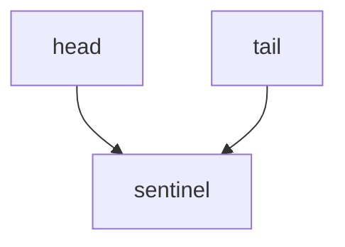
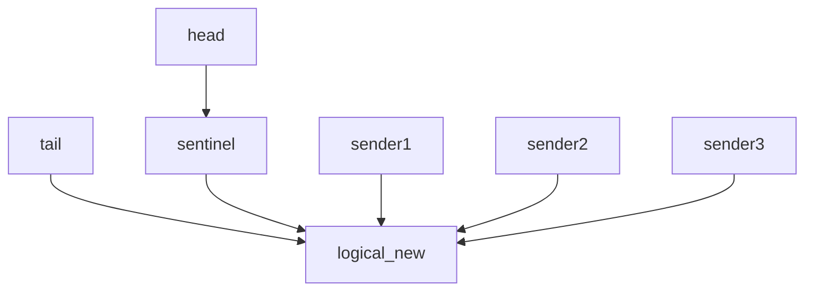
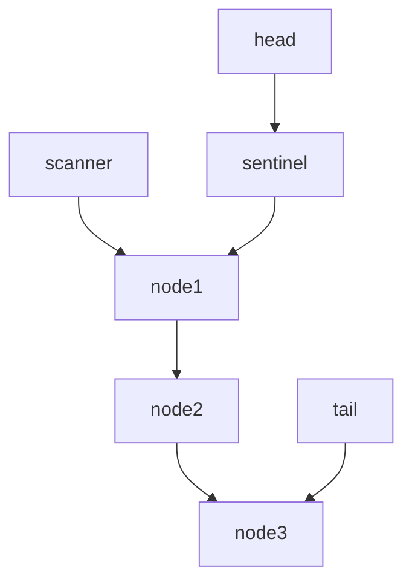

# 基于Key排序的mpsc.

Key-based mpsc provides a mpsc unbouned channel, with keys collision detection.

**NOTE: key-based mpsc is on the early stage, security issue has a lot and the performence is bad, don't use it in production environment.**

It uses a simple Linked List struture to implement a lock-free multiple producer, single consumer channel. 

## 频道是如何工作的？
频道刚开始创建的时候，会生成一个 Head 和一个 Tail 指针，分别指向同一个 Sentinel 节点，方便后期的使用。

发送端首先建立一个节点，将消息保存在刚刚建立的节点中。之后发送端尝试对 Tail 的下一个节点进行CAS操作，每次只会有一个带信息的节点被成功存入，失败的发送端会再次进行CAS尝试。

处于简单的原则，接收端每次都从链表的开头开始读取，在读取的过程中会修改节点中的信息。因为只有一个消费者（接收端），所以同步比较简单。

当频道不再使用时，Drop函数会从头开始自动回收所有的链表节点。

## 冲突检测是如何工作的
每一个 Msg 都带有一个过滤器的克隆（过滤器本身只含有一个 Arc, 所以克隆并不会完整的将所有数据克隆），当接收端接收到消息后，接收端会将接收到的 Key 插入过滤器中，表示 Active 的状态；当其他接收器进行接收时，会首先检查 Msg 的 Key 会不会与接收器中的任何 Key 发生冲突，如果冲突的话则直接跳过，进行下一个消息的接收，如果除冲突的 Key 以外，没有任何消息可以接收，则返回一个 Err。在消息Drop时，会从过滤器中自动删除所持有的key，取消 Active 状态。

## 下一步可能的优化
1. 使用成熟的GC算法进链表进行回收。
2. 加入读时销毁功能，接收端在读完信息后自动回收已经使用过的节点。  
3. 设置时钟周期性地自动回收被标记的节点（最简单的GC）。 
4. 使用 Loom 库替代 std 的原子操作，测试更多竞争现象发生的可能性。
5. 使用更加成熟链表。
