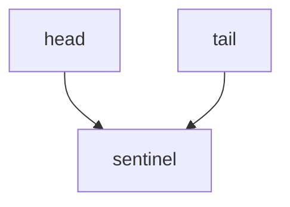
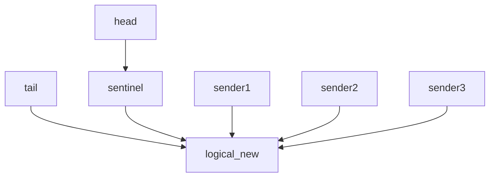
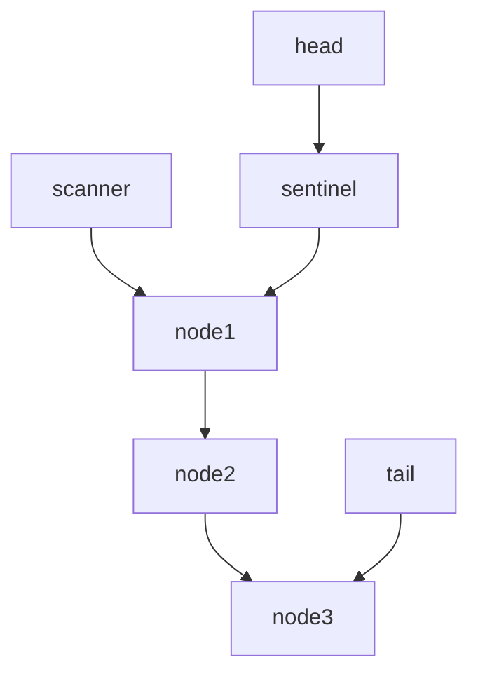

# Key-based mpsc.

Key-based mpsc provides a mpsc unbouned channel, with keys collision detection.

**NOTE: key-based mpsc is on the early stage, security issue has a lot and the performence is bad, don't use it in production environment.**

It uses a simple Linked List struture to implement a lock-free multiple producer, single consumer channel. 

## How this channel works
Initially, we have a head and a tail which points to a Linked List sentinel node.

sender uses CAS operation to append new Node on the logical position (tail's next), only one of them would win the game.

For the sake of simplisity, receiver scans elements from head to the end evety iteration, because there is only single consumer, it's easy to synchronize.

When everything is done, drop function will drop the linked list.

## Next
use some more sophisticitied GC algorithms to free the linked list.  
add *free on read* support.  
set a timer to clean the linked list perioradicly.  
use loom (a crate) to test more race conditions.  